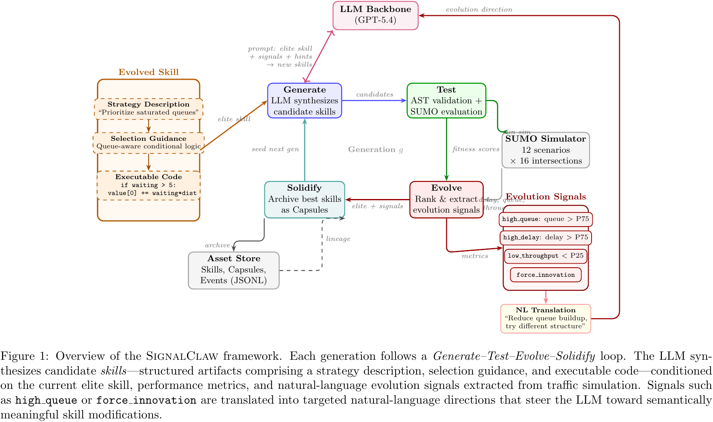
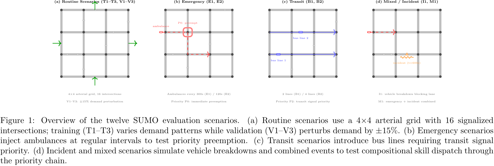
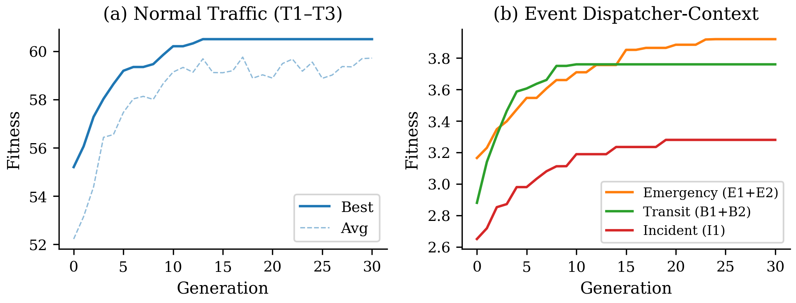

# SignalClaw

**LLM-Guided Evolutionary Synthesis of Interpretable Traffic Signal Control Skills**

[中文说明](README_zh.md)

This repository is organized as a lightweight public-facing codebase inspired by the presentation style of [DeepSignal](https://github.com/AIMS-Laboratory/DeepSignal), while keeping SignalClaw's own code structure and experimental artifacts.

## Overview

SignalClaw studies interpretable traffic signal control with large language models used as **offline evolutionary skill generators**.

Instead of deploying a black-box neural policy, SignalClaw deploys compact executable control skills that can be:

- inspected by humans
- audited and versioned
- edited without retraining a neural controller

Each evolved skill contains:

- a strategy description
- a selection guidance block
- executable scoring code

## Repository Scope

This public repository currently includes:

- core framework code under `evoprog/`
- representative experiment scripts under `scripts/`
- original figure sources and rendered figures under `images/`
- original paper tables under `tables/`

This repository intentionally does **not** include:

- the paper manuscript PDF
- large simulation outputs
- full SUMO scenario assets and bulky training artifacts

## Framework

<p align="center">
  
</p>

The framework figure above is rendered directly from the original paper source `images/src/fig1_framework.tex`, not from a screenshot.

SignalClaw follows a four-stage loop:

1. `Generate`: the LLM synthesizes candidate skills from the current elite and structured guidance.
2. `Test`: candidate skills are executed in SUMO.
3. `Evolve`: simulation metrics are translated into evolution signals.
4. `Solidify`: the best skill is archived and reused as the next-generation seed.

## Scenarios

<p align="center">
  
</p>

The scenario figure above is rendered directly from `images/src/fig_scenario_overview.tex`.

The paper evaluates:

- routine scenarios: `T1`, `T2`, `T3`
- validation scenarios: `V1`, `V2`, `V3`
- emergency scenarios: `E1`, `E2`
- transit scenarios: `B1`, `B2`
- incident scenario: `I1`
- mixed-event scenario: `M1`

## Key Results

### Evolution Improvement

| Skill | Scenarios | Initial | Best | Gen | Improvement |
|---|---|---:|---:|---:|---:|
| Normal | T1+T2+T3 | 55.20 | 60.50 | 12 | 9.6% |
| Emergency | E1+E2 | 3.15 | 3.92 | 22 | 24.4% |
| Transit | B1+B2 | 2.88 | 3.76 | 8 | 30.6% |
| Incident | I1 | 2.65 | 3.28 | 18 | 23.8% |

### Evolution Curves

<p align="center">
  
</p>

### Routine Traffic Performance

| Scenario | Type | FixedTime | MaxPressure | PI-Light | DQN | SignalClaw |
|---|---|---:|---:|---:|---:|---:|
| T1 | Train | 47.3 ± 1.5 | 13.8 ± 0.9 | 8.5 ± 0.7 | **7.9 ± 1.2** | 8.7 ± 0.6 |
| T2 | Train | 43.6 ± 1.3 | 12.5 ± 0.8 | 8.1 ± 0.6 | 8.4 ± 1.1 | **7.8 ± 0.4** |
| T3 | Train | 52.1 ± 1.8 | 14.2 ± 1.0 | **7.9 ± 0.8** | 8.3 ± 1.3 | 8.4 ± 0.7 |
| V1 | Valid | 49.8 ± 1.6 | 14.5 ± 1.0 | 9.3 ± 0.8 | **8.7 ± 1.4** | 9.1 ± 0.6 |
| V2 | Valid | 46.2 ± 1.4 | 13.9 ± 0.9 | 9.6 ± 0.7 | **8.5 ± 1.2** | 9.2 ± 0.8 |
| V3 | Valid | 51.5 ± 1.7 | 14.8 ± 1.1 | **8.8 ± 0.7** | 9.4 ± 1.5 | 9.1 ± 0.5 |

### Event-Aware Evaluation

| Scenario | Method | Avg Delay | Emergency Delay | Person-Delay | Queue |
|---|---|---:|---:|---:|---:|
| E1 | FixedTime | 48.5 ± 1.6 | 385.2 ± 48.7 | - | 32.4 ± 1.2 |
| E1 | MaxPressure | 14.2 ± 1.0 | 42.3 ± 6.8 | - | 8.9 ± 0.7 |
| E1 | PI-Light | **9.8 ± 0.8** | 55.2 ± 9.1 | - | 5.7 ± 0.5 |
| E1 | DQN | 11.3 ± 2.1 | 78.5 ± 32.4 | - | 6.8 ± 1.5 |
| E1 | SignalClaw | 11.5 ± 0.7 | **14.7 ± 2.8** | - | 6.9 ± 0.5 |
| E2 | FixedTime | 50.2 ± 1.8 | 425.8 ± 55.3 | - | 34.1 ± 1.3 |
| E2 | MaxPressure | 15.1 ± 1.1 | 72.3 ± 5.8 | - | 9.5 ± 0.8 |
| E2 | PI-Light | **10.5 ± 0.9** | 78.5 ± 7.6 | - | 6.2 ± 0.6 |
| E2 | DQN | 12.1 ± 2.3 | 95.3 ± 38.7 | - | 7.4 ± 1.6 |
| E2 | SignalClaw | 12.3 ± 0.7 | **11.2 ± 2.1** | - | 7.5 ± 0.5 |
| B1 | FixedTime | 47.8 ± 1.5 | - | 520.3 ± 68.5 | 31.9 ± 1.1 |
| B1 | MaxPressure | 13.5 ± 0.9 | - | 38.7 ± 5.2 | 8.3 ± 0.6 |
| B1 | PI-Light | **9.5 ± 0.7** | - | 42.3 ± 6.1 | 5.4 ± 0.4 |
| B1 | DQN | 10.8 ± 2.0 | - | 65.4 ± 28.6 | 6.5 ± 1.4 |
| B1 | SignalClaw | 10.9 ± 0.6 | - | **9.8 ± 1.5** | 6.6 ± 0.4 |
| B2 | FixedTime | 51.3 ± 1.9 | - | 485.6 ± 62.1 | 35.2 ± 1.4 |
| B2 | MaxPressure | 14.8 ± 1.1 | - | 45.2 ± 6.4 | 9.2 ± 0.7 |
| B2 | PI-Light | 10.8 ± 0.9 | - | 48.7 ± 7.2 | 6.4 ± 0.5 |
| B2 | DQN | **10.5 ± 2.2** | - | 58.3 ± 24.5 | 6.3 ± 1.5 |
| B2 | SignalClaw | 11.8 ± 0.8 | - | **11.5 ± 1.8** | 7.1 ± 0.6 |
| I1 | FixedTime | 53.2 ± 2.1 | - | - | 36.5 ± 1.5 |
| I1 | MaxPressure | 16.2 ± 1.3 | - | - | 10.3 ± 0.9 |
| I1 | PI-Light | 11.5 ± 0.9 | - | - | 6.9 ± 0.6 |
| I1 | DQN | 12.8 ± 2.5 | - | - | 7.9 ± 1.7 |
| I1 | SignalClaw | **10.8 ± 0.9** | - | - | **6.5 ± 0.6** |
| M1 | FixedTime | 54.1 ± 2.2 | 352.5 ± 45.8 | - | 37.2 ± 1.6 |
| M1 | MaxPressure | 16.8 ± 1.4 | 55.3 ± 8.1 | - | 10.7 ± 0.9 |
| M1 | PI-Light | **12.1 ± 1.0** | 62.4 ± 9.5 | - | 7.3 ± 0.6 |
| M1 | DQN | 13.5 ± 2.6 | 82.7 ± 35.4 | - | 8.3 ± 1.8 |
| M1 | SignalClaw | 13.2 ± 0.7 | **18.5 ± 3.2** | - | 8.0 ± 0.5 |

## Code Organization

```text
SignalClaw/
├── README.md
├── README_zh.md
├── main.py
├── pyproject.toml
├── requirements.txt
├── evoprog/
├── scripts/
│   ├── run_eventclaw_experiment.py
│   └── glm5_configs/
├── figures/
├── images/
│   ├── fig_framework.png
│   ├── fig_scenarios.png
│   ├── fig_evolution_curves.png
│   └── src/
├── scenarios/
│   └── README.md
└── tables/
    ├── TABLE_main_results.tex
    ├── TABLE_routine_results.tex
    └── TABLE_event_results.tex
```

Key directories:

- `evoprog/`: core evolution, evaluator, executor, LLM, and storage modules
- `scripts/`: experiment and configuration entry points
- `images/src/`: original paper figure sources
- `scenarios/`: placeholder location for SUMO scenario assets
- `tables/`: original paper table sources

## Quick Start

```bash
git clone https://github.com/Radar-Lei/SignalClaw.git
cd SignalClaw
pip install -e .
python main.py --help
```

If you want to run the full SUMO pipeline, you will also need:

- SUMO installed locally
- scenario assets placed under the expected `scenarios/` paths
- an OpenAI-compatible API endpoint or local LLM service

## Example Snippets

### Event Priority

```python
EVENT_PRIORITY = {
    "emergency": 0,
    "incident": 1,
    "transit": 2,
    "congestion": 3,
    "normal": 4,
}
```

### Normal Evolution Config

```toml
[evolution]
pop_size = 8
generations = 30
stagnation_threshold = 8
elite_count = 2

[store]
store_dir = "store/gpt5_evolve/normal"
```

### Interpretable Skill Example

```python
value[0] += (
    inlane_2_num_waiting_vehicle
    * max(1, inlane_2_num_vehicle)
    / max(1, inlane_2_vehicle_dist)
)

if outlane_2_num_vehicle > 5:
    value[0] -= outlane_2_num_vehicle ** 1.1
```

## Maintainer

- Owner: `Radar-Lei`
- GitHub: `https://github.com/Radar-Lei`
- Email: `greatradar@gmail.com`
- License: `CC BY-NC 4.0`
