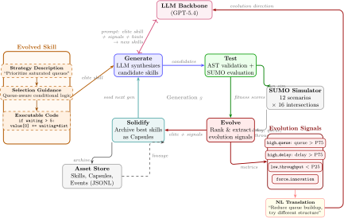
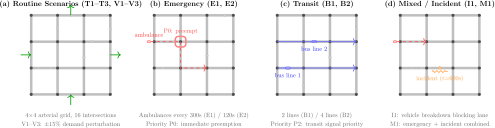

# SignalClaw

**面向可解释交通信号控制的 LLM 引导进化技能框架**

[English README](README.md)

## 项目简介

真实世界中的交通信号控制，不只是要“跑得好”，还要**能解释、能审计、能修改**。这正是很多现有方法的短板：

- 深度强化学习虽然能优化性能，但学到的是黑盒神经策略，难以审计和人工接管
- 经典程序合成方法虽然可解释，但通常受限于手工设计的狭窄 DSL
- 许多已有方法本质上是**事件盲**的，难以处理救护车优先、公交优先、事故和严重拥堵等关键场景

SignalClaw 的核心思想是：让大语言模型做**离线技能进化器**，而不是在线控制器。

真正部署到 SUMO 或控制系统中的，不是黑盒神经网络，而是体量很小、可以直接检查和修改的控制代码。

每个技能包含三部分：

- 策略说明
- 选择指导
- 可执行评分代码

## 为什么是 SignalClaw

SignalClaw 不是简单的“让 LLM 写点 TSC 代码”。结合论文中的方法与实验，它的关键优势在于：

- **信号驱动进化**：把队列、延迟、吞吐、停滞等统计量提炼成结构化进化信号，再转换成自然语言反馈指导下一代搜索。
- **自说明技能表示**：进化单元不是裸代码，而是“策略意图 + 决策指导 + 可执行实现”的组合体。
- **事件组合式控制**：将 `emergency / incident / transit / congestion / normal` 分别进化，再通过确定性的优先级调度器在线组合。
- **部署时保持确定性**：LLM 只在离线进化阶段使用，在线执行的是普通代码，因此行为可预测、可复现。
- **混合事件零样本组合**：不同事件技能可以在混合场景中通过 dispatcher 直接组合，不需要联合再训练。

## 仓库包含什么

当前公开目录中保留了：

- `evoprog/` 下的核心框架代码
- `scripts/` 下的代表性实验脚本和配置
- `images/` 下的原始图与渲染图
- `tables/` 下的论文原始表格源码

当前目录中**不包含**：

- 论文 PDF
- 大体积训练输出
- 全量 SUMO 场景数据

## 方法框架

<p align="center">
  <a href="images/fig_framework.svg">
    
  </a>
</p>

上图直接由论文原始图源 `images/src/fig1_framework_body.tex` 渲染而来，不是截图。点击图片可以查看更清晰的矢量版本。

这个框架可以从三层来理解：

- **技能表示层**：每个技能同时包含人类可读的策略意图、决策指导和可执行代码。
- **进化闭环层**：`Generate -> Test -> Evolve -> Solidify`。
- **反馈引导层**：仿真结果会被转成诸如高队列、高延迟、低吞吐、停滞等信号，再驱动下一轮 LLM 变异。

这正是 SignalClaw 相对 RL 更可解释、相对固定 DSL 搜索更灵活的关键来源。

## 评测场景

<p align="center">
  <a href="images/fig_scenarios.svg">
    
  </a>
</p>

上图直接由 `images/src/fig_scenario_overview_body.tex` 渲染而来，不是截图。点击图片可以查看更清晰的矢量版本。

评测共覆盖 12 个 SUMO 配置，底层网络是 `4x4` 干道网格：

- **常规训练**：`T1`、`T2`、`T3`
- **常规验证**：`V1`、`V2`、`V3`，通过流量扰动构造
- **紧急车辆**：`E1`、`E2`，测试不同频率下的救护车优先
- **公交优先**：`B1`、`B2`，测试按乘客加权的人均延迟优化
- **事故场景**：`I1`，测试阻塞车道后的响应
- **混合事件**：`M1`，测试在 emergency + incident 下的零样本组合能力

这个实验设计很关键，因为 SignalClaw 不只在常规交通上比较，还明确针对稀疏但高风险的事件场景进行评估。

## 主要结果

论文主要支持四个核心结论：

- 在常规交通上，SignalClaw 与每个场景下的最佳方法只相差 `3% 到 10%`，同时方差保持较低。
- 在紧急车辆场景中，SignalClaw 取得了所有比较方法中**最低的 emergency delay**。
- 在公交优先场景中，SignalClaw 取得了**最低的 person-delay**，更符合真实社会成本。
- 在混合事件场景中，独立进化得到的事件技能能够通过优先级调度器正确组合，无需重新训练。

### 进化增益

| Skill | Scenarios | Initial | Best | Gen | Improvement |
|---|---|---:|---:|---:|---:|
| Normal | T1+T2+T3 | 55.20 | 60.50 | 12 | 9.6% |
| Emergency | E1+E2 | 3.15 | 3.92 | 22 | 24.4% |
| Transit | B1+B2 | 2.88 | 3.76 | 8 | 30.6% |
| Incident | I1 | 2.65 | 3.28 | 18 | 23.8% |

### 进化曲线

<p align="center">
  
</p>

在 30 代进化过程中，常规技能的 fitness 从 `55.20` 提升到 `60.50`，事件特化技能则取得了 `23.8% 到 30.6%` 的提升。

### 常规交通性能

在 6 个常规场景上，SignalClaw 的平均延迟落在 `7.8s 到 9.2s` 区间，在保持完整可解释性的同时，与 PI-Light 和 DQN 保持竞争力。

| Scenario | Type | FixedTime | MaxPressure | PI-Light | DQN | SignalClaw |
|---|---|---:|---:|---:|---:|---:|
| T1 | Train | 47.3 ± 1.5 | 13.8 ± 0.9 | 8.5 ± 0.7 | **7.9 ± 1.2** | 8.7 ± 0.6 |
| T2 | Train | 43.6 ± 1.3 | 12.5 ± 0.8 | 8.1 ± 0.6 | 8.4 ± 1.1 | **7.8 ± 0.4** |
| T3 | Train | 52.1 ± 1.8 | 14.2 ± 1.0 | **7.9 ± 0.8** | 8.3 ± 1.3 | 8.4 ± 0.7 |
| V1 | Valid | 49.8 ± 1.6 | 14.5 ± 1.0 | 9.3 ± 0.8 | **8.7 ± 1.4** | 9.1 ± 0.6 |
| V2 | Valid | 46.2 ± 1.4 | 13.9 ± 0.9 | 9.6 ± 0.7 | **8.5 ± 1.2** | 9.2 ± 0.8 |
| V3 | Valid | 51.5 ± 1.7 | 14.8 ± 1.1 | **8.8 ± 0.7** | 9.4 ± 1.5 | 9.1 ± 0.5 |

### 事件场景性能

事件场景结果应理解为**端到端系统比较**：SignalClaw 使用事件检测 + 调度 + 特化技能，而对比基线在这些场景下仍然是事件盲的迁移使用。

其中最重要的结果是：

- **紧急车辆**：SignalClaw 的 emergency delay 为 `11.2s 到 18.5s`，明显优于 MaxPressure 的 `42.3s 到 72.3s` 和 DQN 的 `78.5s 到 95.3s`。
- **公交优先**：SignalClaw 的 person-delay 为 `9.8s 到 11.5s`，明显优于 MaxPressure 的 `38.7s 到 45.2s`。
- **混合事件**：在 `M1` 上，SignalClaw 在保持整体交通稳定的同时取得了最佳 emergency delay。

| Scenario | Method | Avg Delay | Emergency Delay | Person-Delay | Queue |
|---|---|---:|---:|---:|---:|
| E1 | FixedTime | 48.5 ± 1.6 | 385.2 ± 48.7 | - | 32.4 ± 1.2 |
| E1 | MaxPressure | 14.2 ± 1.0 | 42.3 ± 6.8 | - | 8.9 ± 0.7 |
| E1 | PI-Light | **9.8 ± 0.8** | 55.2 ± 9.1 | - | 5.7 ± 0.5 |
| E1 | DQN | 11.3 ± 2.1 | 78.5 ± 32.4 | - | 6.8 ± 1.5 |
| E1 | SignalClaw | 11.5 ± 0.7 | **14.7 ± 2.8** | - | 6.9 ± 0.5 |
| E2 | FixedTime | 50.2 ± 1.8 | 425.8 ± 55.3 | - | 34.1 ± 1.3 |
| E2 | MaxPressure | 15.1 ± 1.1 | 72.3 ± 5.8 | - | 9.5 ± 0.8 |
| E2 | PI-Light | **10.5 ± 0.9** | 78.5 ± 7.6 | - | 6.2 ± 0.6 |
| E2 | DQN | 12.1 ± 2.3 | 95.3 ± 38.7 | - | 7.4 ± 1.6 |
| E2 | SignalClaw | 12.3 ± 0.7 | **11.2 ± 2.1** | - | 7.5 ± 0.5 |
| B1 | FixedTime | 47.8 ± 1.5 | - | 520.3 ± 68.5 | 31.9 ± 1.1 |
| B1 | MaxPressure | 13.5 ± 0.9 | - | 38.7 ± 5.2 | 8.3 ± 0.6 |
| B1 | PI-Light | **9.5 ± 0.7** | - | 42.3 ± 6.1 | 5.4 ± 0.4 |
| B1 | DQN | 10.8 ± 2.0 | - | 65.4 ± 28.6 | 6.5 ± 1.4 |
| B1 | SignalClaw | 10.9 ± 0.6 | - | **9.8 ± 1.5** | 6.6 ± 0.4 |
| B2 | FixedTime | 51.3 ± 1.9 | - | 485.6 ± 62.1 | 35.2 ± 1.4 |
| B2 | MaxPressure | 14.8 ± 1.1 | - | 45.2 ± 6.4 | 9.2 ± 0.7 |
| B2 | PI-Light | 10.8 ± 0.9 | - | 48.7 ± 7.2 | 6.4 ± 0.5 |
| B2 | DQN | **10.5 ± 2.2** | - | 58.3 ± 24.5 | 6.3 ± 1.5 |
| B2 | SignalClaw | 11.8 ± 0.8 | - | **11.5 ± 1.8** | 7.1 ± 0.6 |
| I1 | FixedTime | 53.2 ± 2.1 | - | - | 36.5 ± 1.5 |
| I1 | MaxPressure | 16.2 ± 1.3 | - | - | 10.3 ± 0.9 |
| I1 | PI-Light | 11.5 ± 0.9 | - | - | 6.9 ± 0.6 |
| I1 | DQN | 12.8 ± 2.5 | - | - | 7.9 ± 1.7 |
| I1 | SignalClaw | **10.8 ± 0.9** | - | - | **6.5 ± 0.6** |
| M1 | FixedTime | 54.1 ± 2.2 | 352.5 ± 45.8 | - | 37.2 ± 1.6 |
| M1 | MaxPressure | 16.8 ± 1.4 | 55.3 ± 8.1 | - | 10.7 ± 0.9 |
| M1 | PI-Light | **12.1 ± 1.0** | 62.4 ± 9.5 | - | 7.3 ± 0.6 |
| M1 | DQN | 13.5 ± 2.6 | 82.7 ± 35.4 | - | 8.3 ± 1.8 |
| M1 | SignalClaw | 13.2 ± 0.7 | **18.5 ± 3.2** | - | 8.0 ± 0.5 |

## 目录结构

```text
SignalClaw/
├── README.md
├── README_zh.md
├── main.py
├── pyproject.toml
├── requirements.txt
├── evoprog/
├── scripts/
├── figures/
├── images/
│   ├── fig_framework.png
│   ├── fig_framework.svg
│   ├── fig_scenarios.png
│   ├── fig_scenarios.svg
│   ├── fig_evolution_curves.png
│   └── src/
├── scenarios/
│   └── README.md
└── tables/
```

其中：

- `evoprog/` 是核心代码
- `scripts/` 是实验入口和配置
- `images/src/` 保存论文原始图源
- `scenarios/` 是 SUMO 场景文件预留位置
- `tables/` 保存论文原始表格源码

## 快速开始

```bash
git clone <repository-url>
cd SignalClaw
pip install -e .
python main.py --help
```

如果要运行完整 SUMO 实验，还需要你自行补充：

- 本地 SUMO 环境
- `scenarios/` 目录下的场景资源
- 可用的 LLM API 或本地模型服务

## 代码示例

### 事件优先级

```python
EVENT_PRIORITY = {
    "emergency": 0,
    "incident": 1,
    "transit": 2,
    "congestion": 3,
    "normal": 4,
}
```

### 常规进化配置

```toml
[evolution]
pop_size = 8
generations = 30
stagnation_threshold = 8
elite_count = 2

[store]
store_dir = "store/gpt5_evolve/normal"
```

### 可解释技能代码示例

```python
value[0] += (
    inlane_2_num_waiting_vehicle
    * max(1, inlane_2_num_vehicle)
    / max(1, inlane_2_vehicle_dist)
)

if outlane_2_num_vehicle > 5:
    value[0] -= outlane_2_num_vehicle ** 1.1
```

## License

`CC BY-NC 4.0`
